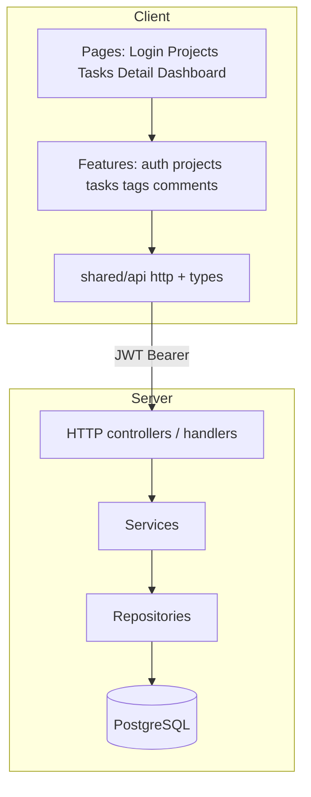

# FlowBoard — совместный fullstack-проект

Учебный продукт для пары (или тройки) разработчиков: **один фронтенд на Vue 3** и **backend на Go и/или Java**, с общим REST-контрактом.

Цель — не «ещё один туториал ради галочки», а **законченное портфолио-приложение**: регистрация → проекты → задачи → теги → комментарии → деплой.

```text
┌─────────────┐         REST + JWT          ┌──────────────────────┐
│  Vue 3 SPA  │ ◄─────────────────────────► │  API (Go Gin  или    │
│  flowboard  │      api-contract v0.1      │       Spring Boot)   │
│  -web       │                             │  + PostgreSQL        │
└─────────────┘                             └──────────────────────┘
```

---

## Содержание

1. [Документы проекта](#1-документы-проекта)
2. [Что такое FlowBoard](#2-что-такое-flowboard)
3. [Участники и роли](#3-участники-и-роли)
4. [Сценарии backend](#4-сценарии-backend)
5. [Порядок чтения (онбординг)](#5-порядок-чтения-онбординг)
6. [Архитектура и репозитории](#6-архитектура-и-репозитории)
7. [Правила совместной работы](#7-правила-совместной-работы)
8. [Таймлайн и вехи](#8-таймлайн-и-вехи)
9. [Синхронизация фронта и бэка](#9-синхронизация-фронта-и-бэка)
10. [Инструменты](#10-инструменты)
11. [Критерии готовности](#11-критерии-готовности)
12. [С чего начать](#12-с-чего-начать)
13. [FAQ](#13-faq)

---

## 1. Документы проекта

Читать в таком порядке при первом заходе:

| # | Документ | Для кого | О чём |
|---|----------|----------|--------|
| 1 | **Этот README** | Все | Карта проекта, правила, вехи |
| 2 | [product-spec.md](product-spec.md) | Все | Экраны, домен, слои, DoD, demo script |
| 3 | [api-contract.md](api-contract.md) | Все | HTTP/JSON, статусы, ошибки |
| 4 | [frontend-vue-plan.md](frontend-vue-plan.md) | Frontend | Модули F0–F9 |
| 5a | [backend-go-plan.md](backend-go-plan.md) | Backend Go | Модули B0–B10 |
| 5b | [backend-java-plan.md](backend-java-plan.md) | Backend Java | Модули J0–J10 + JavaRush |

Дополнительно для фронтендера: общий [Vue study plan](../../README.md).

---

## 2. Что такое FlowBoard

**FlowBoard** — персональный трекер учебных/рабочих задач.

### Пользователь умеет

1. Зарегистрироваться и войти (JWT).
2. Создавать **проекты** («Vue Study», «Java API», «Go API»).
3. Вести **задачи**: статус (`todo` / `doing` / `done`), приоритет, дедлайн, описание.
4. Вешать **теги** и фильтровать по ним.
5. Писать **комментарии** в карточке задачи.
6. Смотреть на **дашборде** «сегодня» и «просрочено».

### Зачем такой продукт

| Для frontend | Для backend |
|--------------|-------------|
| Auth, guards, формы | JWT / security filter |
| Списки, фильтры, пагинация | SQL, индексы, query params |
| Pinia + Vue Query | Слои controller → service → repository |
| Loading / empty / error UX | Единый error JSON, валидация |
| Деплой SPA | Docker, migrations, env, CORS |

### Что сознательно не делаем в v1

- Команды, роли, шаринг проектов между людьми  
- WebSocket / real-time  
- Файлы, email-уведомления  
- Полноценный Jira-канбан с DnD (колонки — только nice-to-have)

Подробные эскизы UI и инварианты домена → [product-spec.md](product-spec.md).

---

## 3. Участники и роли

| Роль | Ответственность | Главный план |
|------|-----------------|--------------|
| **Frontend** | Vue SPA, mock→real API, UX состояний | [frontend-vue-plan.md](frontend-vue-plan.md) |
| **Backend Go** | API на Gin + Postgres | [backend-go-plan.md](backend-go-plan.md) |
| **Backend Java** | API на Spring Boot + Postgres (+ JavaRush) | [backend-java-plan.md](backend-java-plan.md) |
| **Все вместе** | Контракт, интеграции, демо | [api-contract.md](api-contract.md) |

Фронтенд **не зависит** от языка backend: оба API обязаны соблюдать один контракт. Можно подключить Go-API, Java-API или оба (переключатель base URL).

### Ожидаемый «output» от каждой роли

См. [product-spec.md §9](product-spec.md) — что сдаёт frontend / backend / jointly.

---

## 4. Сценарии backend

Выберите один сценарий на человека (или оба, если двое backend-друзей).

### A · Go + Gin + PostgreSQL

- Для кого: цель — Go-backend с нуля.  
- Модули: **B0–B10**.  
- Ориентир: **10–12 недель**.  
- План: [backend-go-plan.md](backend-go-plan.md)

### B · Java + Spring Boot + PostgreSQL

- Для кого: JavaRush self-taught.  
  - [Java Syntax](https://javarush.com/courses/java) — завершён  
  - [Java 25](https://javarush.com/courses/java25) — блок OOP, урок **Interfaces**  
- Модули: **J0–J10** параллельно JR (не вместо).  
- Ориентир: **12–16 недель** (OOP/Collections сначала).  
- План: [backend-java-plan.md](backend-java-plan.md)

### Сравнение стеков

| | A · Go | B · Java |
|--|--------|----------|
| HTTP | Gin | Spring Web (MVC) |
| DB access | pgx → repository | JDBC → Spring Data JPA |
| Migrations | golang-migrate | Flyway |
| Auth | JWT middleware | Spring Security + JWT |
| Учёба «сбоку» | Tour of Go + доки | Java 25 → [Spring in Practice](https://javarush.com/courses/spring-in-practice) |
| Первый HTTP | быстрее | позже (после J0–J1) |

Оба сценария должны в итоге отдать **одинаковый** внешний API ([api-contract.md](api-contract.md)).

---

## 5. Порядок чтения (онбординг)

### День 0 (все, 45–60 мин)

1. Этот README (целиком).  
2. [product-spec.md](product-spec.md) — §1–4 (продукт, сценарии, эскизы) + §8 (acceptance).  
3. [api-contract.md](api-contract.md) — пробежать endpoints, зафиксировать вопросы.  
4. Созвон/чат: утвердить контракт **v0.1** (или список правок → v0.2).

### Дальше по роли

| Frontend | Backend Go | Backend Java |
|----------|------------|--------------|
| F0–F1 из frontend-плана | B0–B1 | JR Interfaces + **J0** |
| Mock по контракту | `/health` ASAP | Collections → J1, затем J2 `/health` |

---

## 6. Архитектура и репозитории

### Вариант репозиториев (выберите один)

**Вариант 1 — раздельно (проще права доступа)**

```text
flowboard-web/           # Vue
flowboard-api-go/        # опционально
flowboard-api-java/      # опционально
```

**Вариант 2 — monorepo**

```text
flowboard/
  web/
  api-go/
  api-java/
  docs/   # можно submodule / копией этих md
```

### Логическая схема



Детали слоёв и интерфейсов: [product-spec.md §5–6](product-spec.md).

### Окружения

| Env | Frontend | Backend |
|-----|----------|---------|
| Local | `http://localhost:5173` | `http://localhost:8080` |
| `VITE_API_BASE_URL` | указывает на выбранный API | — |
| DB | — | Postgres 16 в Docker |

CORS: backend разрешает origin фронта (не `*` в «проде»).

---

## 7. Правила совместной работы

### Жёсткие

1. **Контракт раньше фич.** Новые поля/URL → сначала правка [api-contract.md](api-contract.md) + версия (`v0.2`), потом код.  
2. **Один формат ошибок:** `{ "error": { "code", "message" } }`.  
3. **Mock-first на фронте** — не простаивать, пока бэк учит OOP/Go basics.  
4. **DoD на каждую веху:** работает у себя → описано в README/Issue → показано на синке.  
5. **Секреты не в git** (JWT secret, DB password) — только `.env` / `.env.example`.  
6. **Баги в Issues**, не «в голове» и не только в личке.

### Мягкие

- Синк **1–2 раза в неделю**, 20–30 минут.  
- Один milestone за раз: лучше закрыть Projects целиком, чем наполовину Tasks+Tags.  
- Breaking change накануне синка — писать в чат **в тот же день**.  
- Код-стайл: как принято в выбранном стеке; главное — читаемые границы слоёв.

### Шаблон синка (скопировать в чат)

```text
Синк YYYY-MM-DD
Frontend: сделано / блокирует / план на неделю
Backend:  сделано / блокирует / план на неделю
Контракт: без изменений | нужны правки: …
Демо: что покажем через 7 дней
```

### Git-гигиена

- Ветки: `feat/…`, `fix/…`  
- PR с коротким «зачем» + как проверить  
- Не пушить `node_modules`, `.env`, `target/`, бинарники  

---

## 8. Таймлайн и вехи

Общий продуктовый ритм (одинаковые **названия** вех для Go и Java; календарь у Java часто сдвигается на 2–4 недели в начале).

| Веха | Backend | Frontend | Интеграция |
|------|---------|----------|------------|
| M0 Setup | Hello project | Vite + layout + router | Репозитории созданы |
| M1 Health | `GET /health` + CORS | API client, страница статуса | «API online» |
| M2 Auth | Register/Login/Me JWT | Login/Register + guard | Логин end-to-end |
| M3 Projects | CRUD + ownership | Список / создание проектов | CRUD projects |
| M4 Tasks | CRUD + FK | Список задач проекта | CRUD tasks |
| M5 Filters | query + pagination | Фильтры + Vue Query | Фильтрация живая |
| M6 Tags | M2M | Tag chips + filter | Теги |
| M7 Comments | nested resource | Task detail | Комментарии |
| M8 Harden | validation, error codes | empty/loading/error UX | Стабильный контракт |
| M9 Quality | tests + compose | e2e smoke | `compose up` |
| M10 Ship | deploy API | deploy SPA | Публичное демо |

Детальные упражнения:

- Frontend: F0–F9 → [frontend-vue-plan.md](frontend-vue-plan.md)  
- Go: B0–B10 → [backend-go-plan.md](backend-go-plan.md)  
- Java: J0–J10 (+ JR календарь) → [backend-java-plan.md](backend-java-plan.md)

### Приоритет scope (если время кончается)

```text
P0  health, auth, projects, tasks CRUD
P1  filters + pagination
P2  tags
P3  comments
P4  dashboard polish
P5  swagger / e2e / extras
```

Лучше **P0–P3 полностью**, чем полуживой канбан без auth.

---

## 9. Синхронизация фронта и бэка

| Backend на этапе… | Frontend делает… |
|-------------------|------------------|
| Go B0–B2 / Java J0–J3 | F0–F2 на **mock** (MSW / фикстуры по контракту) |
| Go B3–B4 / Java J4–J5 | F3 projects → real API |
| Go B5 / Java J6 | F4 real JWT |
| Go B6–B7 / Java J7–J8 | F5–F6 tasks + tags |
| Go B8–B10 / Java J9–J10 | F7–F9 detail, polish, deploy |

### Два backend сразу

- Env: `VITE_API_GO_URL` и `VITE_API_JAVA_URL` (или переключатель в UI).  
- Один и тот же Postman/Bruno collection гонять на оба.  
- Расхождения с контрактом — Issue с пометкой `go` / `java`.

---

## 10. Инструменты

### Общие

- Git + GitHub (Issues / Projects / PR)  
- Postman / Insomnia / Bruno или `curl`  
- Markdown-контракт → позже OpenAPI/Swagger  

### Frontend

- Vue 3, TypeScript, Vite  
- Vue Router, Pinia, TanStack Vue Query  
- (по желанию) VeeValidate + Zod  
- Стек и теория: [Vue study plan](../../README.md)

### Backend A (Go)

- Go 1.22+  
- Gin, pgx, golang-migrate  
- Docker Postgres 16  
- (опц.) air для live reload  

### Backend B (Java)

- JDK 21+ (25 ок под курс)  
- Spring Boot 3, Flyway, Spring Data JPA, Spring Security  
- Docker Postgres 16  
- JavaRush: Java 25 → Spring in Practice → Spring in Production  

---

## 11. Критерии готовности

### MVP считается готовым, если

- [ ] Register → Login → Logout → Me  
- [ ] Projects CRUD  
- [ ] Tasks CRUD  
- [ ] Фильтры status / priority / `q` + пагинация  
- [ ] Tags: create, assign, unassign, filter  
- [ ] Comments: list, create, delete own  
- [ ] Vue ходит в **реальный** API (не только mock)  
- [ ] Ошибки в формате контракта  
- [ ] `docker compose up` поднимает API + Postgres  
- [ ] README в каждом репо: запуск + пример пользователя  
- [ ] Demo script из [product-spec §8](product-spec.md) проходит за 3–5 минут  

### Портфолио-бонус

- [ ] Скриншоты / короткая гифка  
- [ ] Публичный URL (web + api)  
- [ ] Swagger UI  
- [ ] Известные ограничения списком в README  

---

## 12. С чего начать

### Frontend + Go

1. Утвердить [api-contract.md](api-contract.md) v0.1.  
2. Backend: **B0–B1** (Go basics + Gin `/health`).  
3. Frontend: **F0–F1** (scaffold + http client), дальше mock.  
4. Через ~неделю: демо **API online**.

### Frontend + Java

1. Утвердить контракт v0.1.  
2. Backend: добить JR **Interfaces** + упражнение **J0** (см. java-план).  
3. Frontend: **F0–F1** на mock — **не ждать** Spring.  
4. Первое HTTP-демо — когда готовы **J2** (`/health`), обычно после Collections (**J1**).

### Frontend + Go + Java

1. Контракт — закон для обоих API.  
2. Фронт на mock, затем по очереди подключать готовые вехи.  
3. Сравнивать поведение одним collection запросов.

### Чеклист первого дня

- [ ] Все прочитали README + product-spec §1–4  
- [ ] Контракт v0.1 согласован (или список правок)  
- [ ] Созданы репозитории / ветки  
- [ ] Назначен день первого синка  
- [ ] Каждый знает свой текущий модуль (F* / B* / J*)  

---

## 13. FAQ

**Можно ли менять контракт?**  
Да, через версию и сообщение команде. Молча менять JSON — нельзя.

**Что если backend отстаёт?**  
Фронт продолжает на mock. Интеграция — по вехам M1, M2, M3…

**Нужен ли OpenAPI с первого дня?**  
Нет. Сначала markdown-контракт. Swagger — к M9–M10.

**Один пользователь — несколько устройств?**  
JWT access достаточно для v1. Refresh tokens — вне MVP.

**Дашборд обязателен?**  
Для «готового продукта» желателен; для учебного MVP можно собрать на клиенте из задач. Отдельный `GET /dashboard` — опциональное расширение контракта.

**Где эскизы экранов?**  
[product-spec.md §3](product-spec.md).

**Где JavaRush-привязка?**  
[backend-java-plan.md](backend-java-plan.md) §2–4.

---

## Краткая навигация

| Нужно… | Открыть |
|--------|---------|
| Понять продукт и UI | [product-spec.md](product-spec.md) |
| Согласовать API | [api-contract.md](api-contract.md) |
| План Vue | [frontend-vue-plan.md](frontend-vue-plan.md) |
| План Go | [backend-go-plan.md](backend-go-plan.md) |
| План Java + JR | [backend-java-plan.md](backend-java-plan.md) |
| Учить Vue глубже | [../../README.md](../../README.md) |

---

Удачи. Успех проекта = **регулярные маленькие демо**, а не идеальная архитектура в первый месяц.
