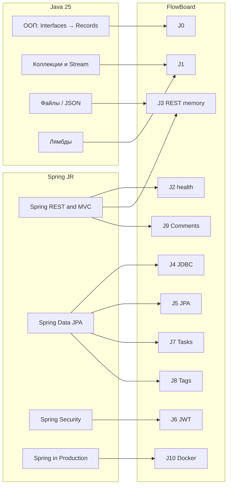

# Backend plan — Java · Spring Boot · PostgreSQL

Учебный трек для self-taught backend-разработчика на **Java**.  
Продукт: **FlowBoard** — [README](README.md) · [product-spec.md](product-spec.md) · [api-contract.md](api-contract.md).

Альтернатива на Go: [backend-go-plan.md](backend-go-plan.md).

План **не заменяет** JavaRush: JR даёт теорию и автопроверку задач, FlowBoard — сквозной pet-project под портфолио и общий API с Vue.

---

## 1. Стартовая точка

| Курс | Ссылка | Статус сейчас |
|------|--------|----------------|
| Java (классический) | https://javarush.com/courses/java | **Java Syntax** завершён |
| Java 25 | https://javarush.com/courses/java25 | Раздел **«ООП и современные возможности»**, урок **Интерфейсы** (5-й в блоке) |

### Как читать два курса JavaRush

| Курс | Роль в этом плане |
|------|-------------------|
| **[Java 25](https://javarush.com/courses/java25)** | **Основной** язык/ООП/коллекции/современный синтаксис |
| **[Java](https://javarush.com/courses/java)** (Syntax уже сдан) | **Опционально** догонять **Java Core** / **Collections**, если хочется больше задач на интерфейсы и коллекции «по-старому» |
| **[Spring in Practice](https://javarush.com/courses/spring-in-practice)** | **Основной** Spring: REST → JPA → Security/JWT |
| **[Spring in Production](https://javarush.com/courses/spring-in-production)** | Финал: тесты, Hibernate deep dive, Docker |

> Рекомендация: после Syntax **не обязательно** проходить весь классический Java до конца, если Java 25 идёт нормально. Classic **Java Core** (интерфейсы, приведение типов) — хороший доп.практикум к J0.

---

## 2. Карта: JavaRush → модули FlowBoard



| FlowBoard | JavaRush (что закрыть / параллельно) |
|-----------|--------------------------------------|
| **J0** | Java 25 · OOP: Interfaces → … → Records → Git |
| **J1** | Java 25 · Коллекции и Stream API (+ лямбды по возможности) |
| **J2–J3** | Spring in Practice · **Spring REST & MVC** |
| **J4–J5, J7–J8** | Spring in Practice · **Spring Data JPA** (+ SQL refresher внутри курса) |
| **J6** | Spring in Practice · **Spring Security** (до JWT) |
| **J9** | REST: validation, `@ControllerAdvice`, CORS (из REST & Security) |
| **J10** | Spring in Production · tests + Docker |

---

## 3. Календарь (ориентир 14–16 недель)

Темп: **~1–2 уровня JR / будни** + **FlowBoard 2–4 вечера / неделю**.

| Недели | JavaRush | FlowBoard | Совместный результат |
|--------|----------|-----------|----------------------|
| 1–2 | Добить OOP-блок Java 25 (с Interfaces) | **J0** | Консольный домен + interface repo |
| 3–5 | Коллекции + Stream (+ лямбды) | **J1** | In-memory фильтры задач + JUnit |
| 6 | Старт Spring in Practice · REST (первые уровни) | **J2** | `GET /health` |
| 7–8 | REST & MVC: controllers, DTO, errors, CRUD | **J3** | Projects CRUD in-memory по контракту |
| 9 | Data JPA: SQL refresher + Postgres + Flyway intro | **J4** | Projects на JDBC + миграции |
| 10 | Data JPA: entity, repository, relations | **J5** | Projects на JPA + ownership prep |
| 11–12 | Security → JWT | **J6** | Register/Login/Me + защита routes |
| 13 | Data JPA: Page, filter, ManyToMany | **J7 + J8** | Tasks + tags |
| 14 | REST polish + Security CORS/errors | **J9** | Comments + единые ошибки |
| 15–16 | Spring in Production (выборочно) | **J10** | Tests + compose + demo с Vue |

Если JR идёт медленнее — **не ускорять Spring**. Лучше сдвинуть календарь, чем получить «скопированный» Boot без понимания.

---

## 4. Модули J0–J10 (подробно)

Каждый модуль: **JR-уроки** → **теория вне JR** → **упражнение FlowBoard** → **DoD** → **что скинуть фронту**.

---

### J0 · Добить ООП (Interfaces → Records)

**Сложность:** ★☆☆☆☆ · **Срок:** 1–2 недели

#### JavaRush — пройти по порядку

Из [Java 25 · «ООП и современные возможности»](https://javarush.com/courses/java25) (ты уже на «Интерфейсы»):

| # в блоке | Урок / тема JR | Зачем в FlowBoard |
|-----------|----------------|-------------------|
| 1–4 | Nested classes → Inheritance → Polymorphism → Abstract classes | *(уже позади / повторить если дыры)* |
| **5** | **Интерфейсы** ← ты здесь | Контракт `TaskRepository` |
| 6 | Продвинутые интерфейсы и functional interfaces (Java 8+) | `Comparator`, будущие колбэки Spring |
| 7 | Record-классы (Java 16+) | DTO / value objects |
| 8 | ООП — типичные ошибки и best practices | Чистый дизайн |
| 9 | Продвинутая работа с исключениями | Свои `NotFoundException` и т.п. |
| 10 | Контроль версий: Git и GitHub | Репозиторий `flowboard-api-java` |

**Опционально classic Java:**  
[Java Core](https://javarush.com/courses/java) — уровни про интерфейсы / `instanceof` / большая задача на интерфейсы — как доп.задачник к J0.

#### Упражнение FlowBoard (без Spring)

Пакет, например `com.flowboard.console`:

```text
domain/
  Task.java          // record Task(String id, String title, String status) {}
  Project.java
repository/
  TaskRepository.java          // interface
  InMemoryTaskRepository.java  // implements
service/
  TaskService.java             // add, list, setStatus
app/
  Main.java                    // меню Scanner: 1 add / 2 list / 3 status
```

Мини-правила:

- статусы только `todo|doing|done` (иначе исключение);
- id — `UUID.randomUUID().toString()`;
- `TaskService` зависит от **интерфейса**, не от класса.

#### DoD

- [ ] JR-уроки 5–10 OOP-блока закрыты (или почти; Git можно параллельно)
- [ ] Можно заменить `InMemoryTaskRepository` на другую реализацию без правок `TaskService`
- [ ] Объясняешь вслух: interface vs abstract class; зачем record
- [ ] Репо на GitHub создан

#### Отдать фронту

Пока ничего HTTP. Можно скинуть скрин консоли / README «домен готов».

---

### J1 · Коллекции и домен FlowBoard в памяти

**Сложность:** ★★☆☆☆ · **Срок:** 2–3 недели

#### JavaRush

[Java 25 · «Коллекции и Stream API»](https://javarush.com/courses/java25):

| Урок / тема JR | Практика в FlowBoard |
|----------------|----------------------|
| Коллекции и generics | `List<Task>`, `Map<String, Project>` |
| Интерфейсы коллекций | Выбор `ArrayList` vs `HashSet` для тегов |
| Работа с коллекциями | CRUD в памяти |
| Компараторы | Сортировка по `due_date`, priority |
| Основы Stream API | filter / map |
| Stream: группировка и агрегация | count by status |
| Stream: объединения и проекции | join task+tag names (упрощённо) |
| Оптимизация / modern collections | `List.copyOf`, unmodifiable (по желанию) |

Параллельно полезен блок **«Лямбда и события»** (3 уровня) — лямбды для Stream.

**Опционально classic:** [Java Collections](https://javarush.com/courses/java) — углубление коллекций / JSON-знакомство.

#### Упражнение

Расширить консольный/модульный проект:

1. Модели из [product-spec.md](product-spec.md): User, Project, Task, Tag (пока без БД).
2. `TaskQuery` record: `status`, `priority`, `q`, `tag`.
3. `TaskService.find(projectId, query)` на Stream.
4. `DashboardService`: overdue / dueToday / counts.
5. **JUnit 5**: ≥ 8 тестов (фильтры, пустой результат, неверный status).

Билд: простой Maven/Gradle **без** Spring пока можно.

#### DoD

- [ ] Закрыт блок Collections (хотя бы до уверенного Stream filter/groupBy)
- [ ] Фильтры совпадают по смыслу с query params контракта
- [ ] `./mvnw test` или `./gradlew test` зелёный
- [ ] Понимаешь `Optional`, `equals/hashCode` для id

#### Отдать фронту

Описание доменных полей (можно markdown-таблицу) — сверить с контрактом.

---

### J2 · Spring Boot Hello

**Сложность:** ★★☆☆☆ · **Срок:** ~1 неделя (можно раньше, если Collections уже ок)

#### JavaRush

Старт [Spring in Practice · Spring REST & MVC](https://javarush.com/courses/spring-in-practice):

- позиционирование курса / сквозной Task Tracker API *(у JR свой учебный проект — **не копируй его endpoints**, делай FlowBoard по нашему контракту)*;
- HTTP глазами backend-разработчика;
- первые уровни про Spring MVC request handling.

Параллельно официальные гайды (ниже).

#### Упражнение

1. JDK **21** (или 25 под курс).  
2. [start.spring.io](https://start.spring.io/): Spring Web, Validation, Actuator (опц.).  
3. Репозиторий `flowboard-api-java`.  
4. `GET /health` → `{ "status": "ok" }` (как в контракте).  
5. `application-dev.yml`, README.

```text
com.flowboard
  FlowboardApplication.java
  web.HealthController.java
```

#### DoD

- [ ] Приложение стартует одной командой
- [ ] Postman/`curl` → 200 JSON
- [ ] Понимаешь `@SpringBootApplication`, `@RestController`, `@GetMapping`

#### Материалы вне JR

- https://spring.io/guides/gs/spring-boot/
- https://spring.io/guides/gs/rest-service/
- https://start.spring.io/

#### Отдать фронту

URL `http://localhost:8080/health` — первая интеграция «API online».

---

### J3 · REST API без БД (Projects)

**Сложность:** ★★☆☆☆ · **Срок:** 1–2 недели

#### JavaRush — Spring REST & MVC (целевые темы)

Иди по курсу, **сразу перенося** идеи в FlowBoard:

| Тема в Spring in Practice (REST) | Сделать в FlowBoard |
|----------------------------------|---------------------|
| URI, карта endpoints | Сверить с [api-contract.md](api-contract.md) |
| path / query / body | Projects CRUD |
| Архитектура: controller → service → in-memory repo | Как в product-spec §5 |
| DTO ≠ внутренняя модель | `ProjectResponse`, `CreateProjectRequest` (records) |
| Jackson / JSON | Сериализация ответов |
| Bean Validation | `@NotBlank` на name |
| `@ControllerAdvice` / error contract | Формат `{ "error": { "code", "message" } }` |
| Pagination envelopes (пока можно упростить) | Заложить `items` + `meta` |
| POST/PUT/PATCH/DELETE | Для projects: POST + PATCH + DELETE |
| `@WebMvcTest` / MockMvc | 3–5 тестов controller |

> JR местами учит на своём Task Tracker — **эндпоинты и JSON бери только из нашего контракта**.

#### Упражнение (обязательный scope)

- `GET/POST /api/v1/projects`
- `GET/PATCH/DELETE /api/v1/projects/{id}`
- In-memory store (`ConcurrentHashMap`)
- Пока без JWT: заголовок-заглушка `X-User-Id` **или** один hardcode user (документировать в README)
- Единые ошибки: `not_found`, `validation_error`

#### DoD

- [ ] CRUD проходит Postman-чек лист
- [ ] Controller тонкий, логика в service
- [ ] Ошибки в формате контракта
- [ ] Хотя бы несколько MockMvc-тестов

#### Отдать фронту

Работающий projects API (можно без auth) + пример запросов в README.

---

### J4 · PostgreSQL + миграции + JDBC

**Сложность:** ★★★☆☆ · **Срок:** 1–2 недели

#### JavaRush

В [Spring Data JPA](https://javarush.com/courses/spring-in-practice) блоке **сначала** возьми:

| Тема JR | Действие |
|---------|----------|
| JDBC / JPA / Hibernate / Spring Data — зачем слои | Прочитать до JPA-кода |
| SQL refresher (таблицы, ключи, joins) | Прорешать / законспектировать |
| SQL refresher write / indexes / transactions | То же |
| Поднимаем PostgreSQL, DataSource, HikariCP | Повторить для FlowBoard |
| Flyway и жизнь схемы | Миграции в нашем репо |

**До JR-SQL:** https://sqlbolt.com/ + [PostgreSQL Tutorial](https://www.postgresql.org/docs/current/tutorial.html)

#### Упражнение

1. `docker compose` только с `postgres:16`.  
2. Flyway: `V1__create_projects.sql`.  
3. Переписать projects persistence на **JdbcTemplate / JdbcClient** (ещё не JPA).  
4. Env: `SPRING_DATASOURCE_URL/USER/PASSWORD`.

Почему JDBC до JPA: увидишь SQL, который потом спрячет Hibernate.

#### DoD

- [ ] Данные живут после рестарта
- [ ] Миграции в git
- [ ] Можешь вслух разобрать `SELECT/INSERT` проекта
- [ ] README: `docker compose up -d` + run app

#### Отдать фронту

Тот же API projects, но уже «настоящая» БД (breaking changes не нужны).

---

### J5 · Spring Data JPA — Projects + подготовка Users

**Сложность:** ★★★☆☆ · **Срок:** 1–2 недели

#### JavaRush — Spring Data JPA

| Тема JR | FlowBoard |
|---------|-----------|
| Первая entity, PK, field mapping | `ProjectEntity` |
| Entity design / value objects | Не тащить лишнее в entity |
| Repository abstraction | `ProjectRepository extends JpaRepository` |
| ManyToOne / OneToMany | `User` 1—N `Project` (можно ввести User уже здесь) |
| Derived queries, Page/Slice | `findByOwnerId(…, Pageable)` |
| `@Transactional` как граница операции | Service-методы |
| Flyway (уже есть) | `V2__users_and_project_owner.sql` |
| `@DataJpaTest` | Тесты репозитория |

Пока **можно** отдать projects без полного JWT (owner из заглушки), но схема `users` уже должна появиться.

#### Упражнение

1. Entities + DTO mapping (ручной).  
2. **Запрет** `@Entity` в `@RestController` return type.  
3. Service проверяет ownership (когда появится userId).

#### DoD

- [ ] JPA CRUD projects
- [ ] Понимаешь lazy/eager на пальцах
- [ ] Есть `@DataJpaTest` или service-тесты с БД

#### Отдать фронту

Стабильный projects API; предупредить о скором включении JWT (J6).

---

### J6 · Spring Security + JWT (Auth)

**Сложность:** ★★★★☆ · **Срок:** 2 недели

#### JavaRush — Spring Security

Иди по блоку Security в [Spring in Practice](https://javarush.com/courses/spring-in-practice); для FlowBoard критичны:

| Тема JR | FlowBoard |
|---------|-----------|
| Зачем Security / filter chain | Общая картина |
| PasswordEncoder | BCrypt |
| DB-backed users, `UserDetailsService` | Таблица `users` |
| Регистрация и жизненный цикл аккаунта | `POST /auth/register` |
| 401 vs 403 | Как в контракте |
| Ownership-based access | Свой / чужой project |
| Stateless API + JWT basics | Access token |
| Выдача JWT + login endpoint | `POST /auth/login` |
| Custom JWT filter **или** Bearer JWT support | `Authorization: Bearer` |
| CORS + frontend integration | Origin Vite `5173` |
| Security MockMvc tests | Негативные кейсы |

Не увязнуть надолго в form-login/session — для SPA нужен **stateless JWT** (в курсе это отдельные уровни ближе к концу Security-блока).

#### Упражнение (контракт)

- `POST /api/v1/auth/register`
- `POST /api/v1/auth/login`
- `GET /api/v1/auth/me`
- Все projects/tasks требуют JWT
- Чужой resource → 403 или 404 (выбрать одно, зафиксировать в README)

#### DoD

- [ ] Пароли не plaintext
- [ ] Без токена → 401
- [ ] Фронт может залогиниться и создать project
- [ ] Секреты только в env (`JWT_SECRET`)

#### Материалы вне JR

- https://docs.spring.io/spring-security/reference/
- https://cheatsheetseries.owasp.org/cheatsheets/Password_Storage_Cheat_Sheet.html

#### Отдать фронту

Auth готов — главная веха интеграции (§ demo в product-spec).

---

### J7 · Tasks: связи, фильтры, пагинация

**Сложность:** ★★★★☆ · **Срок:** 1–2 недели

#### JavaRush — Data JPA (добрать)

| Тема JR | FlowBoard |
|---------|-----------|
| ManyToOne Task→Project | Entity `Task` |
| Derived queries / `@Query` / JPQL | Фильтры |
| Page / Slice | `page`, `limit` → `items`+`meta.total` |
| Specifications (pragmatic) | Динамический filter status+priority+q |
| Индексы / SQL refresher | `(project_id, status)` |
| join fetch / EntityGraph | Список tasks с tags (подготовка к J8) |

Логика фильтров уже есть с **J1** — перенеси на БД.

#### Упражнение

Endpoints tasks из [api-contract.md](api-contract.md).  
Статусы/приоритеты — enum в Java + check в БД/валидации.

#### DoD

- [ ] CRUD + filters + pagination
- [ ] Нельзя писать в чужой project
- [ ] Тест на фильтр + page

#### Отдать фронту

Tasks API — экран списка задач.

---

### J8 · Теги Many-to-Many

**Сложность:** ★★★★☆ · **Срок:** ~1 неделя

#### JavaRush

| Тема JR (Data JPA) | FlowBoard |
|--------------------|-----------|
| controlled ManyToMany | `task_tags` |
| Fetch-ловушки | Не тащить всю графу в list без нужды |
| UNIQUE / DB constraints | `UNIQUE(task_id, tag_id)`, unique tag name per user |

#### Упражнение

Tags CRUD + assign/unassign + `GET tasks?tag=backend` по контракту.  
Tags **per-user** (как в контракте).

#### DoD

- [ ] Несколько тегов на задаче
- [ ] Фильтр по тегу
- [ ] Дубликат связи невозможен

#### Отдать фронту

Tag chips на UI.

---

### J9 · Comments + ошибки + CORS polish

**Сложность:** ★★★★☆ · **Срок:** ~1 неделя

#### JavaRush

Добить/повторить из REST & Security:

- validation (вложенные структуры);
- ProblemDetail / `@ControllerAdvice` / единый error response;
- CORS для SPA;
- method security / ownership для delete comment.

#### Упражнение

1. Comments endpoints.  
2. Стабильные `error.code` из контракта.  
3. CORS только на фронт-origin.  
4. Не логировать password/token.  
5. Сверка всех полей JSON с контрактом (чеклист).

#### DoD

- [ ] Demo script product-spec §8 проходит
- [ ] Vue ходит без «костылей» CORS
- [ ] README: Postman collection или curl-скрипт

---

### J10 · Тесты, Docker, деплой

**Сложность:** ★★★★★ · **Срок:** 1–2 недели

#### JavaRush

[Spring in Production](https://javarush.com/courses/spring-in-production):

| Блок | Что взять минимум |
|------|-------------------|
| Testing | `@WebMvcTest`, `@DataJpaTest`, Testcontainers preview |
| Docker for Spring | Dockerfile + app+Postgres compose |
| Hibernate Deep Dive | По желанию (N+1), если уже больно |

OpenAPI: тема эволюции API / OpenAPI из REST-курса + [springdoc](https://springdoc.org/).

#### Упражнение

1. Unit service + MockMvc security tests + Testcontainers smoke.  
2. `docker compose up` → API+DB.  
3. Deploy (Railway/Render/VPS).  
4. Swagger UI.  
5. Совместное демо с Vue.

#### DoD

- [ ] `go`-аналог: `./mvnw test` зелёный
- [ ] Compose в README
- [ ] Staging URL у фронта работает
- [ ] Чеклист MVP из product-spec закрыт

---

## 5. Рекомендуемый стек (зафиксировать в README репо)

| Слой | Выбор |
|------|--------|
| Language | Java 21+ (25 — ок под курс) |
| Framework | Spring Boot 3.x |
| Web | Spring MVC REST |
| DB | PostgreSQL 16 |
| Access | J4: JDBC → J5+: Spring Data JPA |
| Migrations | Flyway |
| Security | Spring Security + JWT (stateless) |
| Build | Maven или Gradle |
| Docs | springdoc-openapi |
| Tests | JUnit 5, MockMvc, Testcontainers |

---

## 6. Структура репозитория (целевая к J6+)

```text
flowboard-api-java/
├── src/main/java/com/flowboard/
│   ├── FlowboardApplication.java
│   ├── config/          # Security, CORS, OpenAPI
│   ├── domain/          # entities
│   ├── repository/
│   ├── service/
│   ├── web/             # controllers, dto, advice
│   ├── security/        # JWT, UserDetails
│   └── error/           # ApiException, codes
├── src/main/resources/
│   ├── application.yml
│   └── db/migration/    # Flyway
├── src/test/java/...
├── docker-compose.yml
├── Dockerfile
└── README.md
```

Сверка слоёв: [product-spec.md §5](product-spec.md).

---

## 7. Чеклист прогресса

### JavaRush

- [ ] Java 25 · OOP с Interfaces → Git
- [ ] Java 25 · Collections + Stream (+ лямбды)
- [ ] Spring in Practice · REST & MVC (база)
- [ ] Spring in Practice · Data JPA (база + relations + Page)
- [ ] Spring in Practice · Security до JWT
- [ ] Spring in Production · tests/Docker (выборочно)
- [ ] (Опц.) Classic Java Core — интерфейсы

### FlowBoard

- [ ] J0 console domain + interface repo
- [ ] J1 filters + JUnit
- [ ] J2 `/health`
- [ ] J3 projects in-memory REST
- [ ] J4 JDBC + Flyway
- [ ] J5 JPA projects
- [ ] J6 JWT auth
- [ ] J7 tasks + filters
- [ ] J8 tags M2M
- [ ] J9 comments + CORS/errors
- [ ] J10 tests + compose + deploy

---

## 8. Ритм недели (шаблон)

| День | Фокус |
|------|--------|
| Пн–Вт | 1–2 уровня JavaRush (язык или Spring) |
| Ср | Конспект: 5–10 буллетов «как применю в FlowBoard» |
| Чт–Пт | Код FlowBoard текущего J-модуля |
| Сб | Тесты + README + Postman |
| Вс | Синк с фронтом 20–30 мин / отдых |

**Стоп-правило:** не начинать J5, пока J0–J1 не закрыты. Не начинать J6, пока projects стабильно на БД (J4/J5).

---

## 9. Частые ловушки

1. Копировать Task Tracker из JR один-в-один — будет другой API, фронт отвалится.  
2. Прыгнуть в JPA/Security без Collections и SQL refresher.  
3. Отдавать `@Entity` в JSON.  
4. `CORS *` + CSRF-путанца на stateless API.  
5. Секреты в git.  
6. Ломать контракт без `v0.2`.  
7. Учить Virtual Threads раньше, чем CRUD+JWT.

---

## 10. С чего начать сегодня

1. JR Java 25: добить **Интерфейсы** → сразу следующий урок (**продвинутые интерфейсы**).  
2. Создать GitHub `flowboard-api-java` (пустой README ок).  
3. Прочитать [product-spec.md](product-spec.md) §1–5 и [api-contract.md](api-contract.md).  
4. Сделать упражнение **J0** (record + `TaskRepository`).  
5. Написать фронту: «J0 в работе, health ожидайте после старта Spring (J2)».

---

## 11. Полезные ссылки одной пачкой

**JavaRush**

- https://javarush.com/courses/java25  
- https://javarush.com/courses/java  
- https://javarush.com/courses/spring-in-practice  
- https://javarush.com/courses/spring-in-production  

**Официальные / практика**

- https://docs.oracle.com/javase/tutorial/java/IandI/createinterface.html  
- https://sqlbolt.com/  
- https://spring.io/guides  
- https://docs.spring.io/spring-boot/reference/  
- https://documentation.red-gate.com/fd/quickstart-how-flyway-works-184127599.html  
- https://testcontainers.com/guides/getting-started-with-testcontainers-for-java/  
- https://springdoc.org/  

Удачи. Цель — не «пройти JR на 100% уровней», а **законченный FlowBoard API**, который стыкуется с Vue и объясняется своими словами.
