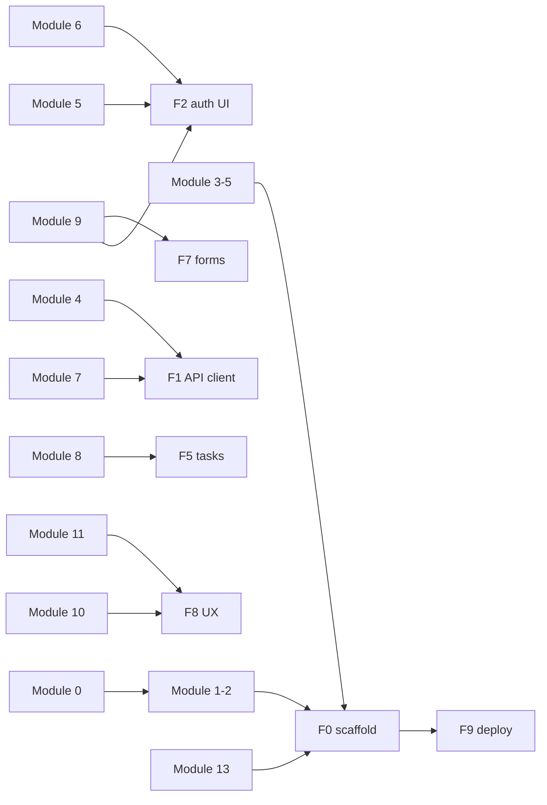

# Frontend plan — Vue 3 (FlowBoard)

Параллельный трек: **изучаешь Vue study plan** и **собираешь FlowBoard** на тех же навыках.  
Не жди Module 14 — после каждого нужного модуля делай срез F*.

| Документ | Зачем |
|----------|--------|
| [README](README.md) | Общие правила, вехи M0–M10 |
| [product-spec.md](product-spec.md) | Экраны, компоненты, DoD |
| [api-contract.md](api-contract.md) | HTTP/JSON |
| [Vue study plan](../../README.md) | Теория Modules 0–15 |
| [RESOURCES](../RESOURCES.md) · [CHEATSHEET](../CHEATSHEET.md) · [DEMOS](../DEMOS.md) | Доп. материалы |

Backend (когда подключать real API):

- Go: [backend-go-plan.md](backend-go-plan.md) (B*)
- Java: [backend-java-plan.md](backend-java-plan.md) (J*)

---

## 1. Главный принцип: курс ∥ FlowBoard

| Делай так | Не делай так |
|-----------|--------------|
| После модуля — маленький кусок FlowBoard | Ждать «весь курс целиком» |
| Mock API, пока бэкенд учится | Простой без дела |
| P0–P3 MVP важнее красоты | Канбан DnD до auth |
| ~60–70% курс / ~30–40% FlowBoard | Бросить теорию ради только кода |



---

## 2. Карта: Vue Modules → FlowBoard F*

| FlowBoard | Минимум из study plan | Ключевые уроки (ссылки) |
|-----------|------------------------|-------------------------|
| **F0** | M0–M1, куски M3/M5/M13 | [create-vue](../module-1/01-create-vue.md), [Vite structure](../module-1/02-vite-project-structure.md), [SFC](../module-1/03-single-file-components.md), [Router](../module-5/01-vue-router-4.md), [feature folders](../module-13/03-shared-ui-entities-features-pages.md) |
| **F1** | M4, M7 | [typing](../module-4/04-interfaces-and-type-aliases.md), [fetch](../module-7/01-fetch.md) / [axios](../module-7/02-axios.md), [errors](../module-7/03-error-handling.md), [data layer](../module-7/09-data-layer.md), [env](../module-13/08-env.md) |
| **F2** | M5, M6, (M9 позже усилить) | [guards](../module-5/10-navigation-guards.md), [Pinia](../module-6/04-pinia.md), [state](../module-6/05-state.md), [actions](../module-6/07-actions.md), [forms](../module-1/13-basic-forms.md), [api mocking](../module-11/07-api-mocking.md) |
| **F3** | M3, M7 | [props/emits](../module-3/01-props.md), [async UI](../module-7/04-async-ui-states.md), [UI patterns](../module-10/06-ui-patterns.md) |
| **F4** | M5–M7 | Guards + auth store + real JWT |
| **F5** | M7, M8 | [pagination](../module-7/05-pagination.md), [query params](../module-7/06-query-params.md), [Vue Query](../module-8/02-vue-query.md), [queries](../module-8/03-queries.md), [invalidation](../module-8/05-invalidation.md) |
| **F6** | M3, M8 | Компоненты чипов + invalidate queries |
| **F7** | M5, M8, M9 | [dynamic routes](../module-5/07-dynamic-routes.md), [nested](../module-5/08-nested-routes.md), [VeeValidate](../module-9/04-veevalidate.md), [Zod](../module-9/05-zod.md), [optimistic](../module-8/06-optimistic-updates.md) |
| **F8** | M10, M11, M12 | [a11y](../module-3/09-accessibility-basics.md), [transitions](../module-10/03-transitions.md), [Vitest](../module-11/01-vitest.md), [component tests](../module-11/04-component-tests.md) |
| **F9** | M12–M13, опц. M14 | [code splitting](../module-12/07-code-splitting.md), [lazy](../module-12/08-lazy-components.md), [deploy mindset](../module-14/10-deployment.md) — SPA на Pages/Netlify достаточно |

**Module 14 (Nuxt)** — не блокер MVP. Можно после F9 как отдельный эксперимент.

**Module 15** — FlowBoard *и есть* твой финальный проект-практика; чеклист: [module-15](../module-15/01-practice-checklist.md).

---

## 3. Синхронизация с backend

| Пока backend… | Frontend |
|---------------|----------|
| Go B0–B2 **или** Java J0–J3 | **F0–F2** на **mock** |
| Go B3–B4 **или** Java J4–J5 | **F3** → real projects API |
| Go B5 **или** Java J6 | **F4** real JWT |
| Go B6–B7 **или** Java J7–J8 | **F5–F6** tasks + tags |
| Go B8–B10 **или** Java J9–J10 | **F7–F9** detail, polish, deploy |

Два API сразу: переключатель `VITE_API_BASE_URL` (Go/Java); UI и типы те же.

---

## 4. Календарь (ориентир 10–14 недель)

Совмести с Vue-модулями (~1 module / week в study plan, плюс FlowBoard вечерами).

| Недели | Study plan | FlowBoard | Результат |
|--------|------------|-----------|-----------|
| 1 | M0–M1 | **F0** старт | Репо + routes + layout |
| 2 | M2–M3 | F0 добить | Базовые компоненты |
| 3 | M4–M5 | **F1** + router guards skeleton | Typed `getHealth` |
| 4 | M5–M6 | **F2** mock auth | Login/Register UI |
| 5 | M7 | **F3** projects mock | Список проектов |
| 6 | M8 | F3→real если бэк готов; иначе mock tasks prep | — |
| 7 | M8–M9 | **F4** + **F5** | JWT + tasks list |
| 8 | M9–M10 | **F6–F7** | Tags + detail/comments |
| 9 | M11–M12 | **F8** | UX + пару тестов |
| 10+ | M13–M14 по желанию | **F9** | Deploy + demo |

Если модуль курса «тяжёлый» — допустимо 2 недели на него; FlowBoard в эти дни только мелкий рефакторинг.

---

## 5. Целевая структура `flowboard-web`

Сверка с [product-spec §6](product-spec.md):

```text
flowboard-web/
├── src/
│   ├── app/
│   │   ├── App.vue
│   │   ├── router/index.ts
│   │   └── providers/        # vue-query, pinia
│   ├── pages/
│   │   ├── LoginPage.vue
│   │   ├── RegisterPage.vue
│   │   ├── DashboardPage.vue
│   │   ├── ProjectsPage.vue
│   │   ├── ProjectTasksPage.vue
│   │   └── TaskDetailPage.vue
│   ├── features/
│   │   ├── auth/
│   │   ├── projects/
│   │   ├── tasks/
│   │   ├── tags/
│   │   └── comments/
│   ├── shared/
│   │   ├── api/http.ts
│   │   ├── api/endpoints.ts
│   │   ├── types/            # DTO = api-contract
│   │   ├── ui/               # Button, Modal, Spinner, EmptyState…
│   │   └── lib/errors.ts
│   └── main.ts
├── .env.example              # VITE_API_BASE_URL, VITE_USE_MOCK=true
└── README.md
```

Архитектура папок: [Module 13](../module-13/01-folder-structure.md), [feature-based](../module-13/02-feature-based.md).

---

## 6. Модули F0–F9 (подробно)

Каждый: **сначала study plan** → **упражнение** → **DoD** → **материалы**.

---

### F0 · Каркас приложения

**Сложность:** ★☆☆☆☆ · **Срок:** ~1 неделя  
**Веха продукта:** M0

#### Изучить в Vue plan

| Тема | Ссылки |
|------|--------|
| Окружение | [Module 0](../../README.md#module-0-подготовка-окружения), [Node/npm](../module-0/03-nodejs-npm-pnpm.md), [editor](../module-0/05-editor-setup-for-vue.md) |
| create-vue / Vite | [01-create-vue](../module-1/01-create-vue.md), [02-structure](../module-1/02-vite-project-structure.md) |
| SFC | [03-sfc](../module-1/03-single-file-components.md), [04-sections](../module-1/04-sfc-sections-template-script-style.md) |
| Router intro | [01-vue-router](../module-5/01-vue-router-4.md), [02-instance](../module-5/02-creating-router-instance.md), [03-link](../module-5/03-router-link.md), [04-view](../module-5/04-router-view.md) |
| Папки | [Module 13 folder](../module-13/01-folder-structure.md), [naming](../module-13/04-naming.md) |

Официально: [Vite](https://vitejs.dev/guide/), [Vue Router](https://router.vuejs.org/), [Vue 3](https://vuejs.org/guide/quick-start.html).

#### Упражнение

1. Репо `flowboard-web` (create-vue: TS, Router, Pinia — Pinia можно подключить сразу).  
2. Routes: `/login`, `/register`, `/projects`, `/projects/:projectId`, `/projects/:projectId/tasks/:taskId`, `/dashboard`.  
3. `AppShell`: nav Dashboard / Projects / placeholder User.  
4. Заглушки pages с заголовками.  
5. `.env.example`: `VITE_API_BASE_URL=http://localhost:8080`, `VITE_USE_MOCK=true`.

Эскизы: [product-spec §3](product-spec.md).

#### DoD

- [ ] `npm run dev` открывает layout  
- [ ] Навигация между заглушками работает  
- [ ] Структура `pages/` + `shared/` есть  
- [ ] README: как запустить  

---

### F1 · API client + типы

**Сложность:** ★★☆☆☆ · **Срок:** ~3–5 дней  
**Веха:** M1 (health)

#### Изучить

| Тема | Ссылки |
|------|--------|
| TypeScript types | [Module 4](../../README.md#module-4-typescript-во-vue), [interfaces](../module-4/04-interfaces-and-type-aliases.md), [API responses](../module-4/05-typing-api-responses.md) |
| HTTP | [fetch](../module-7/01-fetch.md), [axios](../module-7/02-axios.md), [errors](../module-7/03-error-handling.md), [data layer](../module-7/09-data-layer.md) |
| Env | [env](../module-13/08-env.md), [api layer](../module-13/05-api-layer.md) |

Контракт: [api-contract.md](api-contract.md).

#### Упражнение

1. `shared/types` — DTO 1:1 с контрактом (`User`, `Project`, `Task`, `ApiError`…).  
2. `shared/api/http.ts` — baseURL, JSON, парсинг `{ error: { code, message } }`.  
3. Подстановка `Authorization: Bearer` из auth-store (пока можно no-op).  
4. `getHealth()` → страница «API status» или вывод в Dashboard-заглушке.  
5. Режим mock: если `VITE_USE_MOCK=true` — health всегда ok.

#### DoD

- [ ] Typed `getHealth()`  
- [ ] Ошибка API мапится в `ApiError`  
- [ ] Нет `any` в публичных DTO  

---

### F2 · Auth UI (mock)

**Сложность:** ★★☆☆☆ · **Срок:** ~1 неделя  
**Веха:** M2 (UI), real — в F4

#### Изучить

| Тема | Ссылки |
|------|--------|
| Forms basics | [basic forms](../module-1/13-basic-forms.md), [v-model](../module-1/11-v-model.md) |
| Router guards | [navigation guards](../module-5/10-navigation-guards.md), [redirects](../module-5/09-redirects.md) |
| Pinia | [pinia](../module-6/04-pinia.md), [state](../module-6/05-state.md), [actions](../module-6/07-actions.md), [setup stores](../module-6/08-setup-stores.md), [best practices](../module-6/09-store-best-practices.md) |
| Mock | [api mocking](../module-11/07-api-mocking.md) |
| Forms stronger (можно чуть позже) | [VeeValidate](../module-9/04-veevalidate.md), [Zod](../module-9/05-zod.md), [auth forms](../module-9/07-auth-profile-checkout-forms.md) |

#### Упражнение

1. `AuthStore`: `user`, `accessToken`, `login`, `register`, `logout`, `restoreSession`.  
2. Token в `localStorage` (не password).  
3. `LoginPage` / `RegisterPage` по эскизу.  
4. Guard: private routes → `/login`; guest на login при наличии token → `/projects`.  
5. MSW или in-memory mock: register/login/me по контракту.

#### DoD

- [ ] Можно «войти» на mock и увидеть Projects  
- [ ] Logout чистит token  
- [ ] Refresh страницы восстанавливает сессию  

---

### F3 · Projects

**Сложность:** ★★☆☆☆ · **Срок:** ~1 неделя  
**Веха:** M3

#### Изучить

| Тема | Ссылки |
|------|--------|
| Components | [props](../module-3/01-props.md), [emits](../module-3/02-emits.md), [slots](../module-3/03-slots.md) |
| Async UI | [async-ui-states](../module-7/04-async-ui-states.md) |
| UI patterns | [ui-patterns](../module-10/06-ui-patterns.md) |
| Lists | [v-for](../module-1/10-v-for.md), [v-if](../module-1/08-v-if.md) |

#### Упражнение

1. `ProjectsPage`: список карточек, empty/loading/error.  
2. Create modal/form (`name`, `description`).  
3. Rename / delete + `ConfirmDialog`.  
4. Сначала mock; переключатель на real `GET/POST/PATCH/DELETE /api/v1/projects` когда бэк на M3.  
5. Компоненты: `ProjectCard`, `ProjectFormModal`, `EmptyState`.

#### DoD

- [ ] CRUD projects на mock  
- [ ] Три состояния списка  
- [ ] Типы совпадают с контрактом  

---

### F4 · Real auth (JWT)

**Сложность:** ★★★☆☆ · **Срок:** ~3–5 дней после готовности backend auth  
**Веха:** M2 integration

#### Изучить

Повторить F2 + [error handling](../module-7/03-error-handling.md) + guards.

Backend: Go **B5** / Java **J6**.

#### Упражнение

1. `VITE_USE_MOCK=false`, бить real `/auth/*`.  
2. 401 → logout → `/login` + сообщение.  
3. Не логировать token в console.  
4. Проверить CORS с Vite origin.

#### DoD

- [ ] Register/Login end-to-end с API  
- [ ] `/auth/me` после reload  
- [ ] Защищённый `/projects` без token недоступен  

---

### F5 · Tasks list + filters

**Сложность:** ★★★☆☆ · **Срок:** 1–2 недели  
**Веха:** M4–M5

#### Изучить

| Тема | Ссылки |
|------|--------|
| Pagination / query | [pagination](../module-7/05-pagination.md), [query-params](../module-7/06-query-params.md) |
| Server state | [server vs client](../module-8/01-server-state-vs-client-state.md), [vue-query](../module-8/02-vue-query.md), [queries](../module-8/03-queries.md), [mutations](../module-8/04-mutations.md), [invalidation](../module-8/05-invalidation.md) |
| Router params | [dynamic routes](../module-5/07-dynamic-routes.md), [useRoute](../module-5/06-use-route.md) |

Видео/статьи: [RESOURCES Module 8](../RESOURCES.md) (если есть блок).

#### Упражнение

1. `ProjectTasksPage` — таблица (или простой board).  
2. `TaskFilters`: status, priority, `q`; sync с query string (желательно).  
3. Пагинация `meta.page/limit/total`.  
4. Vue Query keys: `['tasks', projectId, filters]`.  
5. Create task form; смена status (select).  
6. Mock → real (Go B6 / Java J7).

#### DoD

- [ ] Фильтры и page меняют список  
- [ ] Invalidate после create/update  
- [ ] Loading/empty/error  

---

### F6 · Tags

**Сложность:** ★★★☆☆ · **Срок:** ~3–5 дней  
**Веха:** M6

#### Изучить

Компоненты ([Module 3](../../README.md#module-3-компонентная-архитектура)), invalidation ([05-invalidation](../module-8/05-invalidation.md)).

#### Упражнение

1. `TagChips` на задаче / в фильтрах.  
2. Create tag, assign, unassign.  
3. Фильтр `?tag=` в tasks query.  
4. Real: Go B7 / Java J8.

#### DoD

- [ ] Несколько тегов на задаче  
- [ ] Фильтр по тегу работает  
- [ ] UI по эскизу product-spec  

---

### F7 · Task detail + comments

**Сложность:** ★★★☆☆ · **Срок:** ~1 неделя  
**Веха:** M7

#### Изучить

| Тема | Ссылки |
|------|--------|
| Nested routes (опц.) | [nested routes](../module-5/08-nested-routes.md) |
| Forms | [Module 9](../../README.md#module-9-формы-и-валидация), [complex v-model](../module-9/01-complex-v-model.md), [VeeValidate](../module-9/04-veevalidate.md), [Zod](../module-9/05-zod.md) |
| Optimistic | [optimistic updates](../module-8/06-optimistic-updates.md) |

#### Упражнение

1. `TaskDetailPage` — edit fields, tags, save.  
2. `CommentList` + `CommentForm`.  
3. Delete own comment + confirm.  
4. (Опц.) optimistic add comment.  
5. Real: Go B8 / Java J9.

#### DoD

- [ ] Полный сценарий U7 из product-spec  
- [ ] Валидация пустого body комментария  

---

### F8 · UX hardening + тесты

**Сложность:** ★★★☆☆ · **Срок:** ~1 неделя  
**Веха:** M8–M9

#### Изучить

| Тема | Ссылки |
|------|--------|
| UX / a11y | [accessibility](../module-3/09-accessibility-basics.md), [transitions](../module-10/03-transitions.md), [ui-patterns](../module-10/06-ui-patterns.md) |
| Testing | [Vitest](../module-11/01-vitest.md), [VTU](../module-11/02-vue-test-utils.md), [component tests](../module-11/04-component-tests.md), [philosophy](../module-11/09-testing-philosophy.md) |
| Perf lite | [unnecessary rerenders](../module-12/02-unnecessary-rerenders.md), [lazy components](../module-12/08-lazy-components.md) |

#### Упражнение

1. Toasts / inline errors по `error.code`.  
2. Skeletons на списках.  
3. Confirm на все delete.  
4. Базовый адаптив (не ломается на 375px).  
5. 3–5 component/unit тестов (AuthForm, TaskFilters, error mapper).  
6. Dashboard: today / overdue (клиентски или API later).

#### DoD

- [ ] Demo script product-spec §8 удобно показывать  
- [ ] Нет «белого экрана» на ошибках API  
- [ ] Хотя бы несколько автотестов зелёные  

---

### F9 · Deploy + demo

**Сложность:** ★★☆☆☆ · **Срок:** 2–4 дня  
**Веха:** M10

#### Изучить

| Тема | Ссылки |
|------|--------|
| Build / split | [code-splitting](../module-12/07-code-splitting.md), [page load](../module-12/09-page-load-optimization.md) |
| Deploy ideas | [deployment](../module-14/10-deployment.md) (идеи; для SPA — Pages/Netlify) |
| Env prod | [env](../module-13/08-env.md) |

#### Упражнение

1. `npm run build` без ошибок.  
2. Deploy: Cloudflare Pages / Netlify / Vercel.  
3. `VITE_API_BASE_URL` = staging API; CORS согласован.  
4. README: скрины, тест-аккаунт, ссылки web+api.  
5. Совместное демо 3–5 мин.

#### DoD

- [ ] Публичный URL открывается  
- [ ] Логин против real API  
- [ ] Чеклист MVP из [README §11](README.md) / product-spec  

---

## 7. Definition of Done (каждый экран)

Экран/фича готовы, если:

1. Работает на **mock или real** (режим явный в README / env).  
2. Есть **loading / empty / error**.  
3. Типы = [api-contract.md](api-contract.md).  
4. Можно показать на синке за **≤ 3 минут**.  
5. Нет паролей/токенов в логах и скриншотах README.

---

## 8. Ритм недели (шаблон)

| День | Фокус |
|------|--------|
| Пн–Вт | Уроки текущего Module study plan |
| Ср | Practice checklist модуля **или** конспект → FlowBoard |
| Чт–Пт | Код текущего F* |
| Сб | Полировка + скрин для синка |
| Вс | Синк с backend 20–30 мин / отдых |

**Стоп-правило:** не начинать F5 (Vue Query tasks), пока F0–F2 не закрыты. Не усложнять F5 канбаном, пока таблица+фильтры не стабильны.

---

## 9. Чеклист прогресса

### Study plan (минимум для MVP)

- [ ] Module 0–1  
- [ ] Module 2–3 (компоненты)  
- [ ] Module 4 (типы)  
- [ ] Module 5 (router + guards)  
- [ ] Module 6 (Pinia)  
- [ ] Module 7 (HTTP)  
- [ ] Module 8 (Vue Query)  
- [ ] Module 9 (формы — хотя бы частично к F7)  
- [ ] Module 10–11 (по желанию к F8)  

### FlowBoard

- [ ] F0 scaffold + routes  
- [ ] F1 http client + types + health  
- [ ] F2 auth UI mock  
- [ ] F3 projects  
- [ ] F4 real JWT  
- [ ] F5 tasks + filters  
- [ ] F6 tags  
- [ ] F7 comments  
- [ ] F8 polish + tests  
- [ ] F9 deploy  

---

## 10. Частые ловушки

1. Ждать Nuxt / Module 14 до первого экрана.  
2. Тащить весь server state в Pinia (для tasks — Vue Query).  
3. Смешать DTO и UI-модели без маппинга.  
4. Забыть empty/error — только happy path.  
5. Hardcode `localhost` без env.  
6. Ломать контракт «тихо» под себя.  
7. Дизайн-система на неделю вместо CRUD.

---

## 11. С чего начать сегодня

1. Прочитать [product-spec.md](product-spec.md) §3 (эскизы) и [api-contract.md](api-contract.md).  
2. Если Module 0–1 ещё не закрыты — добить их по [README](../../README.md).  
3. Создать `flowboard-web` и сделать **F0**.  
4. Параллельно написать backend-другу: «я на mock auth/projects, жду `/health`».  

---

## 12. Полезные ссылки одной пачкой

**Внутренние**

- [Vue study plan](../../README.md)  
- [RESOURCES](../RESOURCES.md) · [CHEATSHEET](../CHEATSHEET.md) · [DEMOS](../DEMOS.md)  
- [product-spec](product-spec.md) · [api-contract](api-contract.md) · [FlowBoard README](README.md)  

**Официальные**

- https://vuejs.org/guide/introduction.html  
- https://router.vuejs.org/  
- https://pinia.vuejs.org/  
- https://tanstack.com/query/latest/docs/framework/vue/overview  
- https://vitejs.dev/guide/  
- https://vee-validate.logaretm.com/v4/  
- https://zod.dev/  

Удачи. Курс даёт глубину — FlowBoard даёт доказательство, что ты умеешь собрать продукт.
