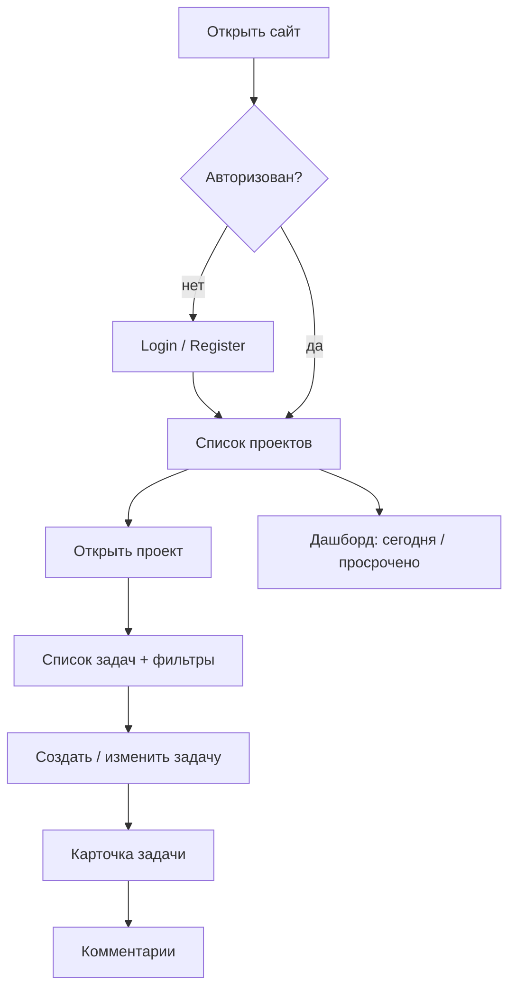
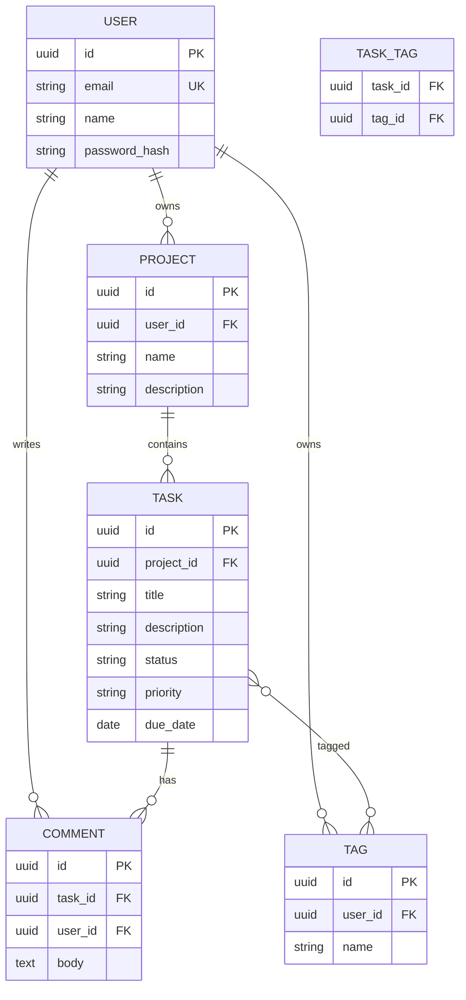
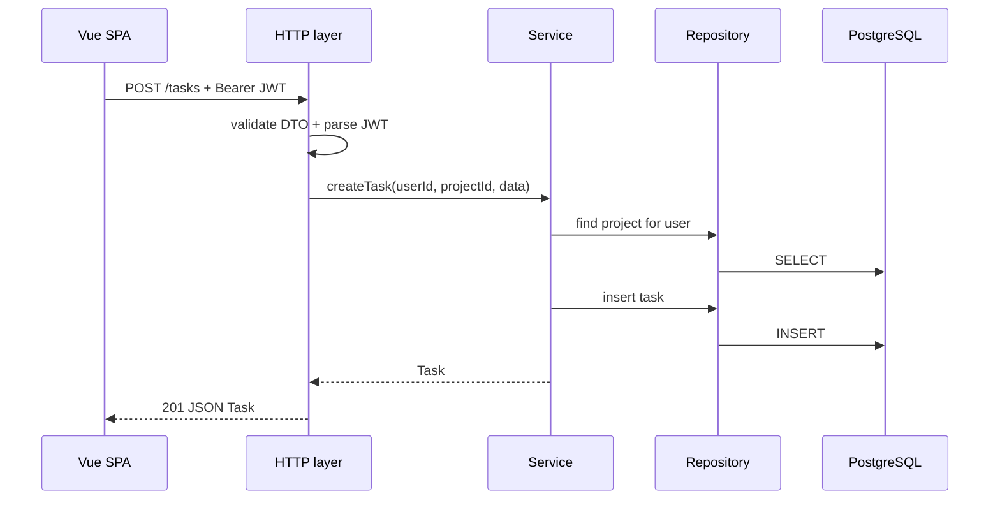

# FlowBoard — описание продукта и ожидаемый результат

Документ для разработчиков: **что строим**, **как это выглядит**, **из каких частей состоит**, **когда считать задачу выполненной**.

Связанные документы:

| Документ | Зачем |
|----------|--------|
| [README](README.md) | Сценарии Go / Java, правила работы |
| [api-contract.md](api-contract.md) | HTTP/JSON контракт |
| [frontend-vue-plan.md](frontend-vue-plan.md) | Учебные шаги фронта |
| [backend-go-plan.md](backend-go-plan.md) / [backend-java-plan.md](backend-java-plan.md) | Учебные шаги бэка |

---

## 1. Что такое FlowBoard

**FlowBoard** — персональный веб-трекер учебных/рабочих задач.

Пользователь:

1. регистрируется и входит;
2. создаёт **проекты** (например «Vue Study», «Java API»);
3. внутри проекта ведёт **задачи** со статусом, приоритетом, дедлайном и **тегами**;
4. открывает задачу и пишет **комментарии**;
5. на дашборде видит, что срочно сегодня и что просрочено.

Это не Jira и не Notion: узкий MVP для портфолио и парной учёбы frontend + backend.

### Цели продукта

- Один понятный happy-path от регистрации до комментария.
- Один стабильный REST API для Vue и для Go/Java backend.
- Достаточно фич, чтобы показать auth, CRUD, фильтры, связи M2M, вложенные ресурсы.

### Не цели (v1)

- Команды, роли, шаринг проектов между пользователями.
- Real-time / WebSocket.
- Вложения файлов, уведомления на email.
- Мобильное native-приложение.
- Сложный канбан с drag-and-drop (колонки статусов — опционально, не обязательно).

---

## 2. Роли и сценарии

В v1 одна роль: **владелец** (всё только своё).

### Основные user journeys



| # | Сценарий | Ожидаемый результат |
|---|----------|---------------------|
| U1 | Регистрация | Аккаунт + JWT + редирект на проекты |
| U2 | Логин | JWT + `/projects` |
| U3 | CRUD проекта | Создать / переименовать / удалить |
| U4 | CRUD задачи | Создать в проекте, сменить статус/приоритет |
| U5 | Фильтрация | По status, priority, tag, тексту `q` + пагинация |
| U6 | Теги | Создать тег, повесить/снять, фильтр по тегу |
| U7 | Комментарии | Список + добавить + удалить свой |
| U8 | Дашборд | Задачи due сегодня + overdue (из всех проектов) |

---

## 3. Экраны (эскизы интерфейса)

Ниже — целевой UI. Точные пиксели не важны; **набор блоков и действия** — важны.

### 3.1 Login / Register

```text
┌─────────────────────────────────────────┐
│  FlowBoard                              │
│                                         │
│   ┌───────────────────────────────┐     │
│   │ Email                         │     │
│   │ Password                      │     │
│   │ [Name — только Register]      │     │
│   │                               │     │
│   │ [ Войти ]  или  [ Создать ]   │     │
│   │ ошибка API (если есть)        │     │
│   └───────────────────────────────┘     │
└─────────────────────────────────────────┘
```

**Обязательно:** валидация пустых полей, показ `error.message`, ссылка Login ↔ Register.

### 3.2 Projects list

```text
┌──────────────────────────────────────────────────────────┐
│ FlowBoard          [Дашборд]  [Проекты]     Ann ▾ Выйти │
├──────────────────────────────────────────────────────────┤
│ Мои проекты                         [ + Новый проект ]   │
│                                                          │
│ ┌─────────────────┐  ┌─────────────────┐                 │
│ │ Vue Study       │  │ Java API        │                 │
│ │ 12 задач        │  │ 5 задач         │                 │
│ │ [Открыть] [···] │  │ [Открыть] [···] │                 │
│ └─────────────────┘  └─────────────────┘                 │
│                                                          │
│ Empty: «Пока нет проектов — создайте первый»             │
└──────────────────────────────────────────────────────────┘
```

`···` = rename / delete (с confirm).

### 3.3 Project tasks (главный рабочий экран)

```text
┌──────────────────────────────────────────────────────────┐
│ ← Проекты / Vue Study                    [ + Задача ]    │
├──────────────────────────────────────────────────────────┤
│ Фильтры:                                                 │
│ Status [все▾] Priority [все▾] Tag [все▾]  q:[______] 🔍  │
├──────────────────────────────────────────────────────────┤
│ Title              Status   Priority  Due      Tags      │
│ Read Gin docs      todo     medium    08-10    backend   │
│ Fix CORS           doing    high      08-05    bug       │
│ Write tests        done     low       —        —         │
├──────────────────────────────────────────────────────────┤
│ ← Prev   Page 1 / 3   Next →           всего: 42         │
└──────────────────────────────────────────────────────────┘
```

Клик по строке → карточка задачи.  
Смена status прямо в таблице — желательно, не обязательно в MVP.

**Альтернатива (nice-to-have):** 3 колонки `todo | doing | done` вместо таблицы.

### 3.4 Task detail + comments

```text
┌──────────────────────────────────────────────────────────┐
│ ← Назад к задачам                                        │
│                                                          │
│ Read Gin docs                         Status [todo ▾]    │
│ Priority [medium ▾]   Due [2026-08-10]                   │
│ Tags: [backend ×] [docs ×]  [ + тег ]                    │
│                                                          │
│ Description                                              │
│ ┌──────────────────────────────────────────────────────┐ │
│ │ Пройти official Gin tutorial…                        │ │
│ └──────────────────────────────────────────────────────┘ │
│ [ Сохранить ]                                            │
│                                                          │
│ Комментарии                                              │
│ ┌──────────────────────────────────────────────────────┐ │
│ │ Ann · 05.08 18:00                                    │ │
│ │ Начать с /health                                     │ │
│ │                                          [Удалить]   │ │
│ └──────────────────────────────────────────────────────┘ │
│ ┌──────────────────────────────────────────────────────┐ │
│ │ Новый комментарий…                                   │ │
│ └──────────────────────────────────────────────────────┘ │
│ [ Отправить ]                                            │
└──────────────────────────────────────────────────────────┘
```

### 3.5 Dashboard

```text
┌──────────────────────────────────────────────────────────┐
│ Дашборд                                                  │
│                                                          │
│ Сегодня (due = today)          Просрочено                │
│ • Fix CORS — Vue Study         • Old bug — Java API      │
│ • Read Gin — Vue Study                                   │
│                                                          │
│ По статусам (все проекты):                               │
│ todo: 10   doing: 3   done: 25                           │
└──────────────────────────────────────────────────────────┘
```

> Дашборд можно собрать на клиенте из уже загруженных задач **или** добавить позже `GET /api/v1/dashboard` (не в контракте v0.1 — опциональное расширение).

---

## 4. Доменная модель



### Инварианты (бизнес-правила)

| Правило | Поведение API |
|---------|----------------|
| Пользователь видит только свои проекты/теги | иначе 404 или 403 |
| Task принадлежит Project владельца | нельзя создать task в чужом project |
| `status ∈ {todo, doing, done}` | иначе 400 `validation_error` |
| `priority ∈ {low, medium, high}` | иначе 400 |
| Tag name уникален **в рамках user** | иначе 409 `conflict` |
| Удалить comment может только автор | иначе 403 |
| Пароль никогда не возвращается в JSON | — |

---

## 5. Внутренние компоненты Backend (ожидаемая архитектура)

Язык (Go / Java) разный — **слои одинаковые**. Это и есть «ожидаемый output» структуры сервиса.

```text
api/
├── cmd/ или Application          # точка входа
├── config/                       # env: PORT, DATABASE_URL, JWT_SECRET, CORS_ORIGIN
├── migrations/                   # SQL: users, projects, tasks, tags, task_tags, comments
├── internal/ (или src/main/java)
│   ├── domain/                   # сущности / records / structs
│   ├── repository/               # SQL / JPA — только данные
│   ├── service/                  # бизнес-правила, транзакции
│   ├── http/ или web/            # handlers/controllers, DTO, validation
│   ├── auth/                     # JWT issue/parse, password hash
│   └── errors/                   # единый error code → HTTP status
├── docker-compose.yml            # api + postgres
└── README.md                     # как запустить
```

### Логические интерфейсы (контракты слоёв)

Имена методов — ориентир; важна **ответственность**.

```text
PasswordHasher
  hash(raw) -> hash
  matches(raw, hash) -> bool

TokenService
  issue(userId, email) -> accessToken
  parse(token) -> claims | error

UserRepository
  create(user) -> user
  findByEmail(email) -> user | empty
  findById(id) -> user | empty

ProjectRepository
  listByUser(userId, page, limit) -> (items, total)
  create(project) -> project
  findByIdForUser(id, userId) -> project | empty
  update(...) / delete(...)

TaskRepository
  list(projectId, filters, page) -> (items, total)
  create / findByIdForUser / update / delete

TagRepository
  listByUser / create / delete
  assign(taskId, tagId) / unassign(taskId, tagId)

CommentRepository
  listByTask / create / deleteOwned

AuthService
  register(email, password, name) -> (user, token)
  login(email, password) -> (user, token)

ProjectService / TaskService / TagService / CommentService
  проверки владения + вызов repository
  никаких HTTP-типов внутри service

HTTP layer
  bind JSON → DTO
  вызвать service
  map domain → response JSON
  map errors → { error: { code, message } }
```

### Минимальный runtime-набор

| Компонент | Обязателен в MVP |
|-----------|------------------|
| Postgres + миграции | да |
| CORS для Vite origin | да |
| JWT Bearer auth | да (с этапа Auth) |
| Health `GET /health` | да |
| Structured logging (без секретов) | да |
| OpenAPI/Swagger UI | желательно к финалу |
| Rate limit на login | желательно |
| Refresh tokens | нет (v1) |

### Поток запроса (ожидаемое поведение)



---

## 6. Внутренние компоненты Frontend (ожидаемая архитектура)

```text
web/
├── src/
│   ├── app/                 # router, layout, providers
│   ├── pages/
│   │   ├── LoginPage
│   │   ├── RegisterPage
│   │   ├── DashboardPage
│   │   ├── ProjectsPage
│   │   ├── ProjectTasksPage
│   │   └── TaskDetailPage
│   ├── features/
│   │   ├── auth/            # store, guards, login form
│   │   ├── projects/
│   │   ├── tasks/
│   │   ├── tags/
│   │   └── comments/
│   ├── shared/
│   │   ├── api/             # http client, typed endpoints
│   │   ├── types/           # DTO = api-contract
│   │   ├── ui/              # Button, Modal, Spinner, EmptyState…
│   │   └── lib/             # date helpers, error map
│   └── main.ts
└── README.md
```

### Ключевые UI-компоненты (контракт экранов)

| Компонент | Ответственность |
|-----------|-----------------|
| `AppShell` | Nav: Dashboard / Projects / User / Logout |
| `AuthForm` | Login/Register fields + submit + error |
| `ProjectCard` / `ProjectFormModal` | Список и создание проекта |
| `TaskFilters` | status, priority, tag, q |
| `TaskTable` или `TaskBoard` | Список задач + пагинация |
| `TaskForm` | Create/edit title, description, status, priority, due |
| `TagChips` | Показ / remove / add tag |
| `CommentList` + `CommentForm` | Тред комментариев |
| `EmptyState` / `ErrorState` / `LoadingState` | Обязательные состояния |
| `ConfirmDialog` | Delete project/task/comment |

### Клиентские модули

```text
AuthStore (Pinia)
  user, accessToken
  login / register / logout / restoreSession

api/http
  baseURL from env
  Authorization header
  parse error.code / error.message

Vue Query (рекомендуется)
  keys: ['projects'], ['tasks', projectId, filters], ['task', id], …
  invalidate после create/update/delete
```

### Состояния каждого списка/формы (DoD для UI)

Каждый экран с данными обязан уметь:

1. **Loading** — скелетон или spinner  
2. **Empty** — понятный CTA  
3. **Error** — текст из API + retry  
4. **Success** — данные + действия  

---

## 7. Карта маршрутов (frontend)

| Path | Auth | Экран |
|------|------|-------|
| `/login` | guest | Login |
| `/register` | guest | Register |
| `/` | private | redirect → `/projects` или `/dashboard` |
| `/dashboard` | private | Dashboard |
| `/projects` | private | Projects list |
| `/projects/:projectId` | private | Tasks |
| `/projects/:projectId/tasks/:taskId` | private | Task detail |

Guest на private → `/login`.  
Authed на guest → `/projects`.

---

## 8. Что считать «готовым продуктом» (acceptance)

### Must-have (MVP demo)

- [ ] Register / Login / Logout / Me
- [ ] Projects CRUD
- [ ] Tasks CRUD внутри проекта
- [ ] Фильтры status + priority + `q` + пагинация
- [ ] Tags: create, assign, unassign, filter `tag`
- [ ] Comments: list, create, delete own
- [ ] CORS + JWT работают с Vue
- [ ] Ошибки в формате контракта
- [ ] `docker compose up` поднимает API + Postgres
- [ ] README: запуск web + api, тестовый пользователь

### Nice-to-have

- [ ] Dashboard aggregates
- [ ] Inline смена status в таблице
- [ ] Kanban-колонки
- [ ] Swagger UI
- [ ] E2E smoke (Playwright/Cypress)

### Demo script (3–5 минут)

1. Register нового пользователя.  
2. Создать проект «Demo».  
3. Создать 3 задачи с разными status/priority/tag.  
4. Отфильтровать `status=todo`.  
5. Открыть задачу, добавить комментарий.  
6. Показать 401 без токена (Postman) — для backend-демо.

---

## 9. Ожидаемый output по ролям

### Frontend developer сдаёт

1. Работающее SPA по эскизам §3.  
2. Типы/клиент, совместимые с [api-contract.md](api-contract.md).  
3. Mock-режим **или** real API (явный env).  
4. Короткий README + скриншоты основных экранов.

### Backend developer сдаёт

1. API, покрывающий контракт (auth → comments).  
2. Слои §5 (не весь CRUD в одном `main`/`Application`).  
3. Миграции + compose.  
4. Postman/Bruno collection или `curl`-примеры в README.  
5. Прохождение demo script §8.

### Вместе

1. Один прогон demo против **реального** API.  
2. Список известных ограничений (Issues).  
3. Версия контракта в README (`v0.1`).

---

## 10. Приоритет реализации (чтобы не размазать scope)

```text
P0  health, auth, projects, tasks CRUD
P1  filters + pagination
P2  tags
P3  comments
P4  dashboard UX polish
P5  swagger / e2e / deploy extras
```

Если время кончается — лучше **P0–P3 полностью**, чем полуживой канбан без auth.

---

## Changelog

| Версия | Дата | Изменения |
|--------|------|-----------|
| 1.0 | 2026-08-05 | Первое подробное описание продукта, UI, слоёв и DoD |
